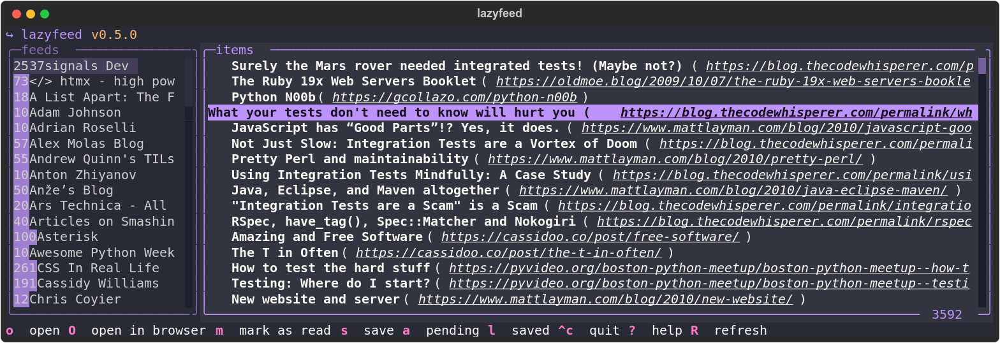
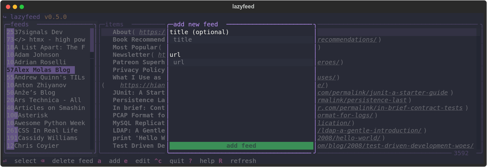
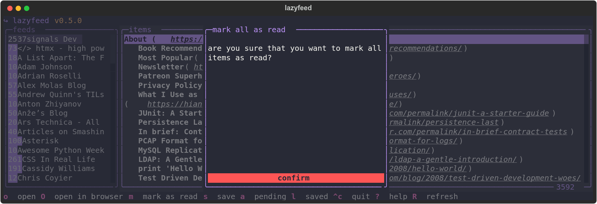
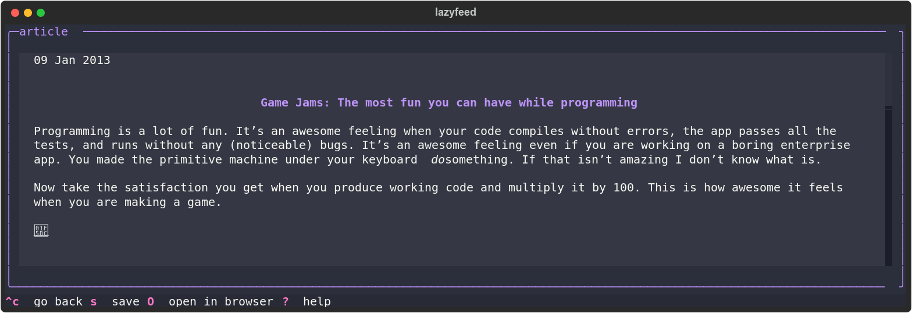
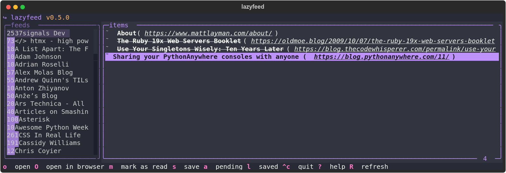

# lazyfeed

<p style="text-align: center">
A fast, modern, and simple RSS/Atom feed reader for the terminal written in pure Python.
</p>



## Features

- Support for RSS/Atom feeds.
- Import from and export feeds.
- Save for later.
- Vim-like keybindings for navigation.
- Theming.
- "In-app" reading support.
- Configuration options.

## Core dependencies

- [textual](https://www.textualize.io/).
- [aiohttp](https://docs.aiohttp.org/en/stable/index.html).
- [feedparser](https://feedparser.readthedocs.io/en/latest/basic.html).
- [sqlalchemy](https://www.sqlalchemy.org/).

## Motivation

For quite some time, I have wanted to build an RSS reader for myself. While I appreciated some existing solutions, I often felt that they were missing key features or included unnecessary ones. I wanted a simple, fast, and elegant way to stay updated with my favorite feeds without the hassle of limits, ads, or cumbersome configuration files.

## Coming up

- Full-text search support.
- Categories.
- Better in-app reading experience.
- Customizable keybindings.

## Installation

The recommended way is by using [uv](https://docs.astral.sh/uv/guides/tools/):

```bash
uv tool install --python 3.13 lazyfeed
```

Now you just need to import your feeds from an OPML file like this:

```bash
lazyfeed < ~/Downloads/feeds.opml
```

Or, after starting `lazyfeed`, adding your favorite feeds one by one:



## Import and export

As you can see importing your RSS feeds is pretty simple and exporting them is as simple as just doing:

```bash
lazyfeed > ~/Downloads/feeds.opml
```

> At the moment only OPML is supported.

## Configuration

The configuration file for `lazyfeed` is located at `$XSG_CONFIG_HOME/lazyfeed/config.toml`. This file is generated automatically the first time you run `lazyfeed` and will look something like this:

```toml
# Welcome! This is the configuration file for lazyfeed.

# Available themes include:
# - "dracula"
# - "textual-dark"
# - "textual-light"
# - "nord"
# - "gruvbox"
# - "catppuccin-mocha"
# - "textual-ansi"
# - "tokyo-night"
# - "monokai"
# - "flexoki"
# - "catppuccin-latte"
# - "solarized-light"
theme = "dracula"

# If set to true, all items will be marked as read when quitting the application.
auto_read = false

# If set to true, items will be fetched at start.
auto_load = false

# If set to false, items will be marked as read without asking for confirmation.
confirm_before_read = true

# Specifies by which attribute the items will be sorted.
sort_by = "published_at" # "title", "is_read", "published_at"

# Specifies the sort order.
sort_order = "ascending" # "descending", "ascending"

[client]
# Maximum times (in seconds) to wait for all request operations.
timeout = 300

# Timeout for establishing a connection.
connect_timeout = 10

[client.headers]
# This section defines the HTTP headers that will be sent with
# each request.
# User-Agent = "Mozilla/5.0 (X11; Linux x86_64) AppleWebKit/537.36 (KHTML, like Gecko) Chrome/128.0.0.0 Safari/537.36"
# Accept = "text/html,application/xhtml+xml,application/xml;q=0.9,image/avif,image/webp,image/apng,*/*;q=0.8"
# Accept-Language = "en-US,en;q=0.6"
# Accept-Encoding = "gzip,deflate,br,zstd"
```

> The folder that holds the configuration file as well as the SQLite database is determined by the `get_app_dir` utility provided by `click`. You can read more about it [here](https://click.palletsprojects.com/en/stable/api/#click.get_app_dir).

## Usage

To start using `lazyfeed` you just need to run:

```bash
lazyfeed
```

## Some screenshots





> The theme used for the screenshots is `dracula`.
