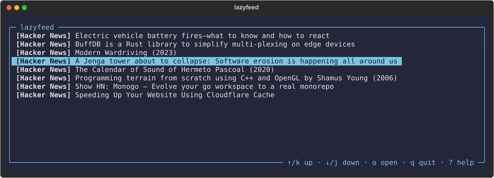
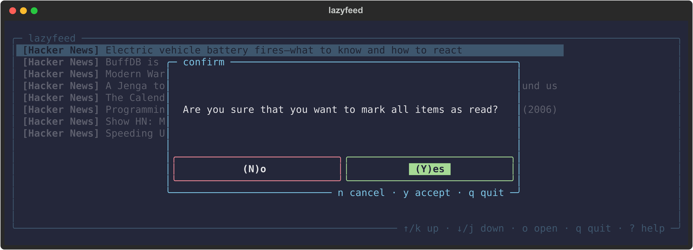
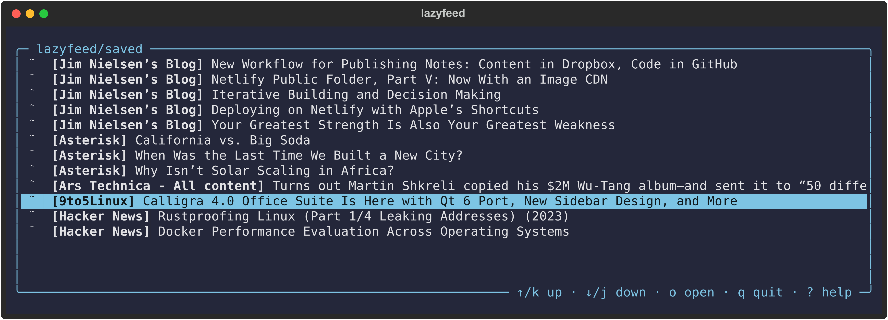
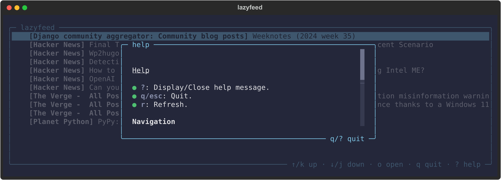

# lazyfeed



A fast, modern and simple RSS/Atom feed reader for the terminal written in Python.

## Features

- Save posts for later.
- Mark posts as favorite.
- Vim-like keybindings.
- Custom configuration.
- Filtering (Coming soon).
- Theming (Coming soon).
- In-App view (Coming soon).
- Docker support (Coming soon).

> `lazyfeed` is a personal project, and the features I will be working on are tailored to my own needs and preferences at the moment.

## Motivation

I wanted a simple and fast way to follow RSS feeds directly in my terminal, without relying on services like [Feedly](https://feedly.com/) or similar platforms. While existing tools like [newsboat](https://github.com/newsboat/newsboat) and [nom](https://github.com/guyfedwards/nom) are available and there are more mature, I wanted to create my own, and here it is.

## Install

There are several ways to install `lazyfeed`:

### Via `pip`

```bash
pip install lazyfeed
```

### Via [`pipx`](https://github.com/pypa/pipx)

```bash
pipx install lazyfeed

```

### Via [`uv`](https://github.com/astral-sh/uv)

```bash
uv tool add lazyfeed

# Or

uvx lazyfeed
```

## Usage

> For a better experience using a [nerd font](https://www.nerdfonts.com/) is recommended.

```bash
lazyfeed add https://dnlzrgz.com/rss # Add a feed.
lazyfeed add https://dnlzrgz.com/rss https://www.theverge.com/rss/index.xml # Add multiple feeds at once.
lazyfeed import feeds.opml # Import from an OPML file.
lazyfeed # Start the TUI
```

> In addition to importing, you can also export all your feeds using the export command. Run `lazyfeed export --help` for more information.

## Keybindings

### General

- `?`: Display/Close help message.
- `q/esc`: Quit.
- `r`: Refresh.

### Navigation

- `j/n`: Move to next post.
- `k/p`: Move to previous post.
- `gg/G`: Jump to first/last post.
- `gp/gn`: Pending/New posts.
- `ga`: All posts.
- `gl`: Saved posts.
- `gf`: Posts marked as favorite.

### Posts

- `o/enter`: Open link in browser and mark post as read.
- `m`: Mark post as read.
- `s`: Save post for later.
- `f`: Mark post as favorite.
- `shift+a`: Mark all posts as read.

## Configuration

If you need to, you can customize some aspects of `lazyfeed` via the `config.toml` file located at `$XDG_CONFIG_HOME/lazyfeed/config.toml`. This file is generated the first time you run `lazyfeed` and looks something like this:

```config.toml
# Welcome! This is the configuration file for lazyfeed.

[app]
# If set to true, all posts will be marked as read when quitting the application.
auto_mark_as_read = false

# If set to true, items will be marked as read without asking for confirmation.
ask_before_marking_as_read = false

# If set to true, displays posts marked as read in the current session.
show_read = false

# Specifies by which attribute the posts will be sorted.
sort_by = "published_date" # "title", "read_status"

# Specifies the sorting order.
sort_order = "desc" # "descending", "asc", "ascending"

[client]
# Maximum times (in seconds) to wait for all request operations.
timeout = 300

# Timeout for establishing a connection.
connect_timeout = 10

[client.headers]
# This section defines the HTTP headers that will be sent with
# each request.
# User-Agent = "Mozilla/5.0 (X11; Linux x86_64) AppleWebKit/537.36 (KHTML, like Gecko) Chrome/128.0.0.0 Safari/537.36"
# Accept = "text/html,application/xhtml+xml,application/xml;q=0.9,image/avif,image/webp,image/apng,*/*;q=0.8"
# Accept-Language = "en-US,en;q=0.6"
# Accept-Encoding = "gzip,deflate,br,zstd"
```

To open the `config.toml` file, you can just run the following command:

```bash
lazyfeed config
```

### Data storage

By default, `lazyfeed` uses a SQLite database file named `lazyfeed.db`, which is located in the configuration directory alongside the `config.toml` file. However, if you prefer, you can change the default database path to use a different database by setting the `db_url` option in the configuration file.

```toml
[app]
db_url = "sqlite:////path/to/your/folder/lazyfeed.db"
```

## Dependencies

- [click](https://click.palletsprojects.com/en/8.1.x/).
- [Textual](https://www.textualize.io/).
- [aiohttp](https://docs.aiohttp.org/en/stable/index.html).
- [feedparser](https://feedparser.readthedocs.io/en/latest/basic.html).
- [sqlalchemy](https://www.sqlalchemy.org/).

## Screenshots




